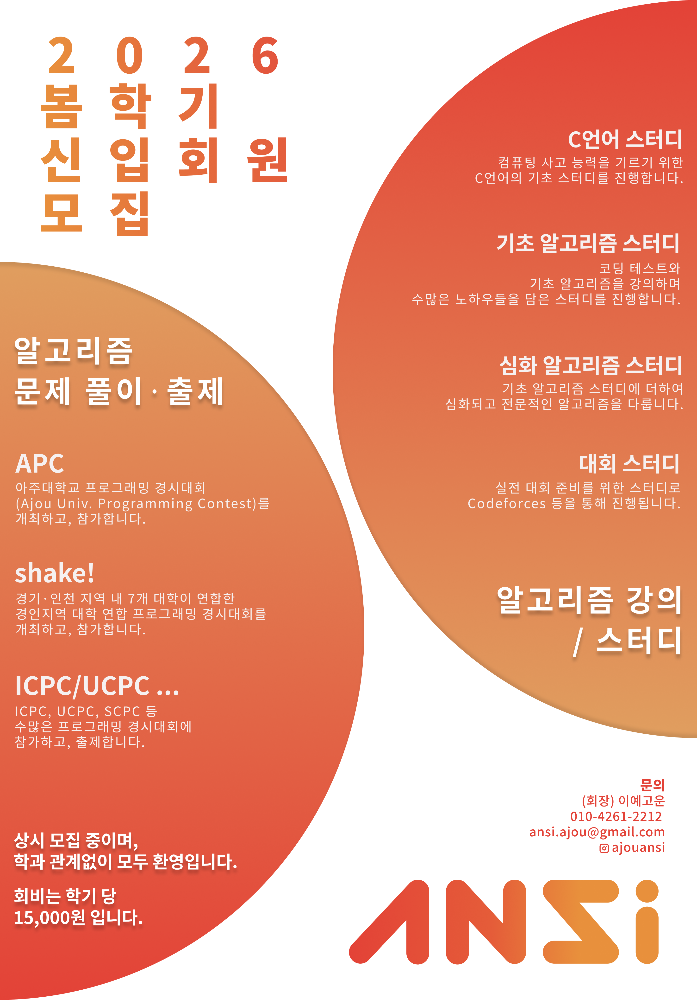
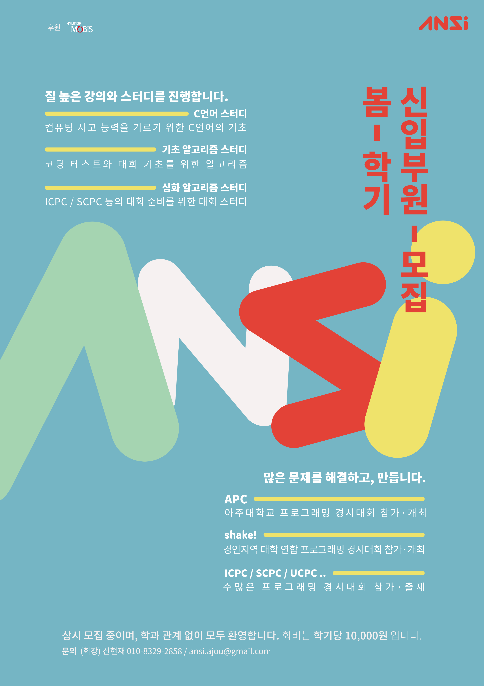

### {{ page.title }}
- 2026-02-24
  - A.N.S.I.의 2026-1학기 회원 모집을 시작하였습니다.
  - [링크](https://forms.gle/yoYJ9ctE5zZypZcK7)에서 자세한 사항을 참고해주세요.
  - 회원 모집은 상시로 받고 있으니, 많은 관심 부탁드립니다!
    - 회비: 학기 당 15,000원
    - 문의: 회장 이예고운 / [010-4261-2212](tel:010-4261-2212) / [ansi.ajou@gmail.com](mailto:ansi.ajou@gmail.com)
  

    
  

- 2025-09-11
  - [2025 한국 대학생 프로그래밍 경시대회(ICPC)](https://icpckorea.org/)의 참가 신청을 받기 시작했습니다.(~9/23)
    - ICPC는 International Collegiate Programming Contest의 약자로 매년 전세계 대학생들이 참가하여 실력을 겨루는 국제 컴퓨터 프로그래밍 대회입니다.\\
    3인 1팀으로 구성된 팀들은 제한시간 내 얼마나 많은 문제를 해결하는가를 놓고 경쟁하게 됩니다.
    - [팀 신청](https://forms.gle/GmBJgYAHSgLdxwRS6)
    - [개인 신청](https://forms.gle/WDtADmXxc5Fdbzc1A) - ANSI 내부에서 팀을 결성합니다.
- 2025-9-09
  - 2학기 개강 총회가 열렸습니다.
  - [링크](https://drive.google.com/file/d/1Py9I_BBvdcBIrtPjeLEGfNuYDIlDdzf_/view?usp=sharing)에서 개강총회 진행 자료를 확인할 수 있습니다.
- 2025-6-23
  - 1학기 종강 총회가 열렸습니다.
  - [링크](https://drive.google.com/file/d/1auA8DPZEFuxOUzRMZz-hD7BQZUNriz1t/view?usp=sharing)에서 종강총회 진행 자료를 확인할 수 있습니다.
- 2025-05-02
  - [APC](https://shake.codes/apc) 참가 신청을 받기 시작했습니다. 많은 관심 부탁드립니다. 
- 2025-03-23
  - [일정](/schedule) 페이지를 추가하였습니다.
  - 이제 ANSI 홈페이지에서 일정을 확인할 수 있습니다.
- 2025-03-18
  - [C언어 스터디](/post/study_c-2025)가 개강하였습니다.
- 2025-03-18
  - [기초 알고리즘 스터디](/post/study_beginner-2025)가 개강하였습니다.
- 2025-03-17
  - [중급 알고리즘 스터디](/post/study_middle-2025)가 개강하였습니다.
- 2025-03-12
  - 2025-1 개강 총회가 열렸습니다.
  - [링크](https://drive.google.com/file/d/1XmVTDE2XVnG-bCTioirsGPyUDdqMjUHS/view?usp=sharing)에서 개강총회 자료를 확인할 수 있습니다.
- 2025-02-18
  - ANSI의 2025-1학기 회원 모집을 시작하였습니다.
  - [링크](https://forms.gle/BNqBxiqaof5KLmgh9)에서 설문 작성하시면 됩니다.
  - 회원 모집은 상시로 받고있으니, 부담 없이 문의해주세요!
    - 회비 : 학기 당 10,000원
    - 문의 : 회장 신현재 / [010-8329-2858](tel:010-8329-2858) / [ansi.ajou@gmail.com](mailto:ansi.ajou@gmail.com)
  

    
  

- 2025-01-25
  - 겨울방학 코딩캠프가 마무리되었습니다.
- 2025-01-11
  - 2024 경인지역 대학 연합 프로그래밍 경시대회 shake!가 마무리되었습니다.
  - [링크](https://www.acmicpc.net/category/1078)에서 대회 문제를 풀어보실 수 있고, [링크](https://www.acmicpc.net/board/view/154753)에서 문제지와 에디토리얼을 확인하실 수 있습니다.
- 2024-12-28
  - 2024 APC - Extra 대회가 성공적으로 마무리되었습니다.
  - [개회식 링크](https://drive.google.com/file/d/1eA9FuzLNctUexG6IV7X2LNIM8JzKGou0/view?usp=sharing), [폐회식 링크](https://drive.google.com/file/d/1XlJRZa8oThIRwE2IOJ8VmUrUHIWi79CA/view?usp=sharing)에서 발표자료를 확인하실 수 있습니다.
- 2024-12-20
  - 2학기 종강 총회가 열렸습니다.
  - [링크](https://drive.google.com/file/d/1xxhI8-WEzcUWQ2f7J5HItf3HlwOEDvkl/view?usp=sharing)에서 종강총회 진행 자료를 확인할 수 있습니다.
- 2024-12-02
  - 기초 알고리즘 스터디가 종강하였습니다. 한 학기동안 수고하셨습니다.
- 2024-12-02
  - 졸업생 세미나의 참여 조사를 받고 있습니다. [링크](https://forms.gle/2pwiSFjzZ6ar7Bu2A)에서 확인할 수 있습니다.
  - 예정 일정과 장소는 다음과 같습니다.
    - 일시: 12월 6일(금) 18:30 ~
    - 장소: 팔달관 309호
    - 대상: ANSI 회원/비회원 상관 없이 아무나(친구 데려오기 가능!)
  - 세미나의 대략적인 목차 및 선배님의 정보도 설문 링크에서 확인할 수 있습니다.
- 2024-11-17
  - ANSI의 홈커밍데이가 성공적으로 마무리되었습니다. 참여해주신 모든 졸업생 선배님들, 재학생들에게 감사드립니다.
  - 홈커밍데이 발표자료는 아래에서 확인할 수 있습니다.
    - [발표자료](https://drive.google.com/file/d/1nZKcMNAxHf7VpRduYSdf0GOAiZkBMaXI/view?usp=sharing)
- 2024-11-10
  - 11월 16일 토요일에 ANSI의 홈커밍 데이가 열립니다!\\
    홈커밍데이는 A.N.S.I. 재학생과 졸업생 선배님들이 함께 모여 소중한 경험을 나누고 소통할 수 있는 자리입니다. 
    - 11월 16일(토) 16시, 팔달관 309호
    - [재학생 참가 신청](https://forms.gle/zAmpuV4nDwBi7S7G6)에서 신청할 수 있습니다.(~11/13)
- 2024-10-26
  - [2024 한국 대학생 프로그래밍 경시대회(ICPC)](https://icpckorea.org/)의 교내 예선이 마무리되었습니다.\\
  팀 *MeatInTheMiddle*의 본선 진출을 축하합니다.
- 2024-09-18
  - [2024 한국 대학생 프로그래밍 경시대회(ICPC)](https://icpckorea.org/)의 참가 신청을 받기 시작했습니다.(~~\~9/24~~ ~~~9/25~~ ~10/1)
    - ICPC는 International Collegiate Programming Contest의 약자로 매년 전세계 대학생들이 참가하여 실력을 겨루는 국제 컴퓨터 프로그래밍 대회입니다.\\
    3인 1팀으로 구성된 팀들은 제한시간 내 얼마나 많은 문제를 해결하는가를 놓고 경쟁하게 됩니다.
    - 교내 예선에서 좋은 성적을 거둔 팀을 대상으로 SW융합교육원에서 상금을 시상합니다.\\
      상격은 대상(1,000,000원), 최우수상(700,000원), 우수상(500,000원)입니다. *적격자가 없을 경우, 시상하지 않을 수 있습니다.
    - ~~[팀 신청](https://forms.gle/uLhb3ZuhZUyQsSZKA)~~
    - ~~[개인 신청](https://forms.gle/GJKvines7oLdzFFL9) - ANSI 내부에서 팀을 결성합니다.~~
- 2024-09-11
  - 2학기 ANSI의 개강총회가 열렀습니다.
  - [링크](https://drive.google.com/file/d/1G0i0HnEJzBPWN6FY6C9H84-ji2h0JMUd/view?usp=sharing)에서 개강총회 진행 자료를 확인할 수 있습니다.
- 2024-08-07
  - ANSI의 2학기 회원 모집을 시작하였습니다.
  - ~~[링크](https://forms.gle/eDLuKhkbTKCNTrU77)에서 설문 작성하시면 됩니다.~~ 마감되었습니다.
  - 회원 모집은 상시로 받고있으니, 부담 없이 문의해주세요!
    - 회비 : 학기 당 10,000원
    - 문의 : 회장 김유겸 / 010-7163-2970 / dbrua1222@ajou.ac.kr
  

    
  

- 2024-06-21
  - 1학기 ANSI의 종강총회가 열렸습니다.
  - [링크](https://drive.google.com/file/d/1ms3qBbUgoQnJBK2eFxt5Ow3H_RmrbETj/view?usp=sharing)에서 종강총회 진행 자료를 확인할 수 있습니다.
- 2024-06-04
  - 1학기의 공식적인 스터디가 모두 종강하였습니다.
- 2024-05-25
  - [APC](https://shake.codes/apc)가 성공리에 마무리되었습니다. 도움을 주신 분들, 참여해주신 모든 분들에게 감사드립니다.
- 2024-05-07
  - [APC](https://shake.codes/apc)의 참가 신청을 받기 시작하였습니다.
- 2024-03-22
  - [심화 알고리즘 스터디](/post/study_hard-2024)가 개강하였습니다.
- 2024-03-19
  - [C언어 스터디](/post/study_c-2024)가 개강하였습니다.
- 2024-03-18
  - 재밌는 [기초 알고리즘 스터디](/post/study_beginner-2024)가 개강하였습니다.
  - 많은 관심 부탁드립니다!
- 2024-03-14
  - 화이트데이 대신 ANSI의 개총이 열렸습니다.
  - [링크](https://drive.google.com/file/d/1djHCGSYjjQiCXHCy1xpQw_v4NDMamKHt/view?usp=sharing)에서 개강총회 진행 자료를 확인할 수 있습니다.
- 2024-03-03
    - 홈페이지가 재단장 후 다시 운영되기 시작했습니다.
    - 신입 회원 모집을 시작합니다.
        - 회비 : 학기 당 10,000원
        - 소속 : 타과생도 환영합니다!
        - ~~[링크](https://forms.gle/BkGtBTEqLwfmyNWJA)에서 폼 작성 후 입금 확인 시 단체 톡 및 디스코드에 초대됩니다.~~ 마감되었습니다.
        - 신입 회원 모집은 상시로 받고 있으니, 부담 없이 신청해주세요!
        - 문의 : 회장 김유겸 / 010-7163-2970 / dbrua1222@ajou.ac.kr
          

    

<!-- _Add your text here_

What's Markdown (`.md`)?

Markdown is markup that lets you write hypertext (HTML) documents
in easy-to-read and easy-to-write plain text.
No angle brackets `<></>` required for
paragraphs, lists, blockquotes, tables, etc.

This is a paragraph (in Markdown). Some more
text here.

This is another paragraph.

This is a list:

- Orange
- Apple
- Blueberry

Just getting started with Markdown?
See the [HTML <-> Markdown Quick Reference (Cheat Sheet)][quickref].

[quickref]: https://github.com/mundimark/quickrefs/blob/master/HTML.md -->
