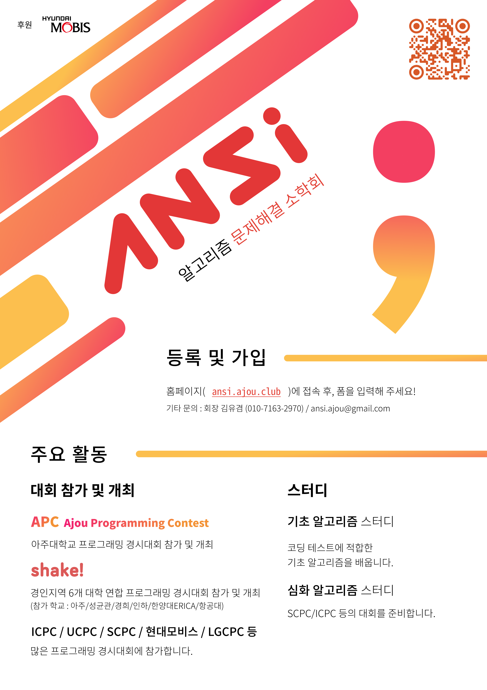

### {{ page.title }}

- 2024-08-07
  - ANSI의 2학기 회원 모집을 시작하였습니다.
  - [링크](https://forms.gle/eDLuKhkbTKCNTrU77)에서 설문 작성하시면 됩니다.
    - 회비 : 학기 당 10,000원
    - 문의 : 회장 김유겸 / 010-7163-2970 / dbrua1222@ajou.ac.kr
  

    
  

- 2024-06-21
  - 1학기 ANSI의 종강총회가 열렸습니다.
  - [링크](https://drive.google.com/file/d/1ms3qBbUgoQnJBK2eFxt5Ow3H_RmrbETj/view?usp=sharing)에서 종강총회 진행 자료를 확인할 수 있습니다.
- 2024-06-04
  - 1학기의 공식적인 스터디가 모두 종강하였습니다.
- 2024-05-25
  - [APC](https://shake.codes/apc)가 성공리에 마무리되었습니다. 도움을 주신 분들, 참여해주신 모든 분들에게 감사드립니다.
- 2024-05-07
  - [APC](https://shake.codes/apc)의 참가 신청을 받기 시작하였습니다.
- 2024-03-22
  - [심화 알고리즘 스터디](/post/study_hard)가 개강하였습니다.
- 2024-03-19
  - [C언어 스터디](/post/study_c)가 개강하였습니다.
- 2024-03-18
  - 재밌는 [기초 알고리즘 스터디](/post/study_beginner)가 개강하였습니다.
  - 많은 관심 부탁드립니다!
- 2024-03-14
  - 화이트데이 대신 ANSI의 개총이 열렸습니다.
  - [링크](https://drive.google.com/file/d/1djHCGSYjjQiCXHCy1xpQw_v4NDMamKHt/view?usp=sharing)에서 개강총회 진행 자료를 확인할 수 있습니다.
- 2024-03-03
    - 홈페이지가 재단장 후 다시 운영되기 시작했습니다.
    - 신입 부원 모집을 시작합니다.
        - 회비 : 학기 당 10,000원
        - 소속 : 타과생도 환영합니다!
        - ~~[링크](https://forms.gle/BkGtBTEqLwfmyNWJA)에서 폼 작성 후 입금 확인 시 단체 톡 및 디스코드에 초대됩니다.~~ 마감되었습니다.
        - 신입 부원 모집은 상시로 받고 있으니, 부담 없이 신청해주세요!
        - 문의 : 회장 김유겸 / 010-7163-2970 / dbrua1222@ajou.ac.kr
          

    

<!-- _Add your text here_

What's Markdown (`.md`)?

Markdown is markup that lets you write hypertext (HTML) documents
in easy-to-read and easy-to-write plain text.
No angle brackets `<></>` required for
paragraphs, lists, blockquotes, tables, etc.

This is a paragraph (in Markdown). Some more
text here.

This is another paragraph.

This is a list:

- Orange
- Apple
- Blueberry

Just getting started with Markdown?
See the [HTML <-> Markdown Quick Reference (Cheat Sheet)][quickref].

[quickref]: https://github.com/mundimark/quickrefs/blob/master/HTML.md -->
